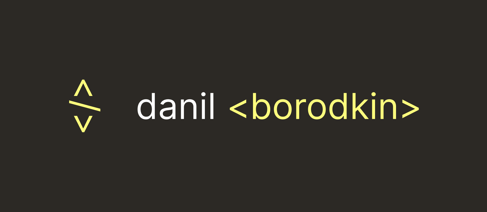

# Hi, I'm Danil!

I'm a freelance Front-End Web Developer.

My focus is on creative development, the core of my skills can be described as the meeting point between creativity and technical proficiency.

My typical projects involve integrating complex but smooth animations and interactions, to present all the website information in an engaging way and make it a memorable experience.

I strive to deliver projects that are visually compelling by working closely with the designer, but also technically outstanding with a clean and properly structured code. All of this, without forgetting about web performance and technical SEO aspects.

My favorite technologies are based on JAMstack/Composable architecture: while my focus is on front-end development, I can also take care of all other stages of the whole development process, from the CMS configuration to the live deployment on the hosting platform.

<h2 align="center">My Online Presence</h2>

<h2 align="center">My Techs & Tools</h2>

<h2 align="center">My GitHub Stats</h2>

    
    

<h2 align="center">Pin's Projects</h2>

---

	By Soorq

