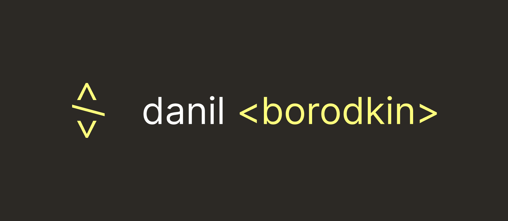

# Hi, I'm Danil!

I'm a **Full-Stack Engineer** with a front-end heart and a DevOps mind.  
I architect, build, and deliver complete digital products — from interactive UIs to resilient backend services and cloud infrastructure.

I believe in **ownership**: I don't just write code, I care about how it runs, scales, and performs in production. My stack spans the entire modern web ecosystem: crafting animation-heavy interfaces with PixiJS and React, designing robust APIs and microservices, and orchestrating deployment pipelines with Docker and cloud tools.

---

### What I bring to the table:

- 🎨 **Front-End & Interactive Experiences**  
  I specialize in creative, high-performance UIs with smooth animations, canvas graphics (PixiJS), and game-like mechanics (including iGaming/slot interfaces). I work closely with design teams to turn complex visuals into clean, maintainable React/Next.js code.

- ⚙️ **Backend & System Design**  
  I design and implement scalable backend services, RESTful APIs, and real-time integrations. I'm comfortable with Node.js, microservices architecture, and database modeling — ensuring the front-end has a solid, reliable foundation.

- ☁️ **DevOps & Infrastructure**  
  I don't stop at the code. I manage deployment pipelines, containerization (Docker), CI/CD workflows, and cloud environments. I ensure applications are secure, monitored, and cost-efficient in production.

- 🧩 **Full Lifecycle Ownership**  
  From technical specification and architecture planning to CI/CD setup, monitoring, and performance tuning — I handle the entire lifecycle. I'm equally comfortable configuring a CMS (Storyblok, etc.) and debugging a memory leak in a Node.js service.

---

### My Tech & Tooling Ecosystem

I work across the entire stack, adapting to the project's needs:

**Frontend**  

**Backend**  

**DevOps & Tools**  

**Languages**  

 *(still learning)*

---

<h2 align="center">Tools & Environment</h2>

---

### A bit more about my approach:

- I build **not just features, but systems** — thinking about error handling, observability, and failover from day one.
- I'm passionate about **performance** — both in the browser (Core Web Vitals, bundle optimization) and on the server (query optimization, caching strategies, load balancing).
- I thrive in **collaborative environments** — whether it's pairing with designers on micro-interactions or aligning with backend teams on API contracts.
- I'm constantly exploring **new technologies** — currently diving into Go for high-performance services and deepening my Kubernetes knowledge.

---

	By Soorq

